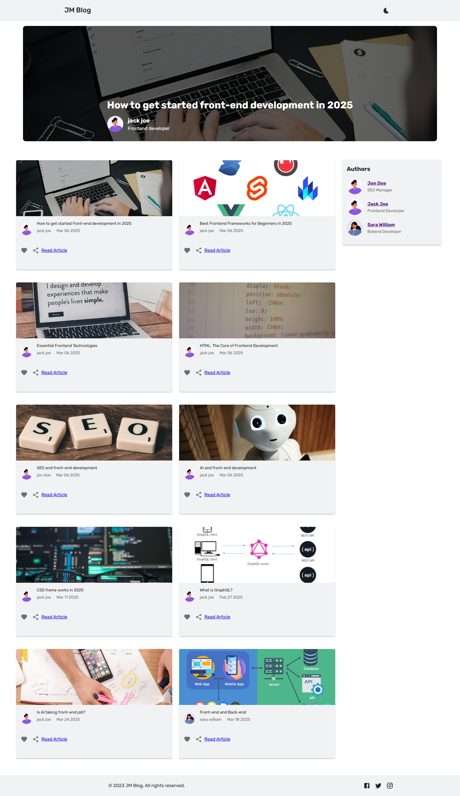

# Blog Application with Hygraph CMS

This is a React-based blog application that takes blog posts from **Hygraph
CMS** using **GraphQL**.

## Features

- **Blog Listing**: Fetches and displays a list of blogs from Hygraph CMS.
- **Single Blog Page**: Displays detailed information about a blog, including
  the author, cover image, and description.
- **Author Pages**: Shows detailed information about authors, including their
  avatar, name, and field.
- **User Interaction**:
  - **Commenting**: Users can leave comments on blogs.
  - **Sharing**: Users can share blogs on social media.
  - **Liking/Disliking**: Users can like or dislike blogs.
- **Skeleton Loading**: Displays skeleton placeholders while data is being
  fetched.
- **Responsive Design**: Built with Material-UI for a responsive and modern UI.

## Technologies Used

- **React**: A JavaScript library for building user interfaces.
- **Material-UI (MUI)**: For styling and UI components.
- **React Router DOM**: For handling dynamic routes.
- **Hygraph CMS**: A headless CMS for managing blog content.
- **GraphQL**: For querying blog and author data.

## Installation

1. Clone Repository

2. Install Dependencies

3. Run Project
